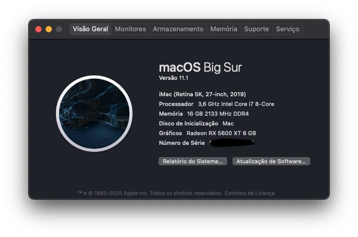
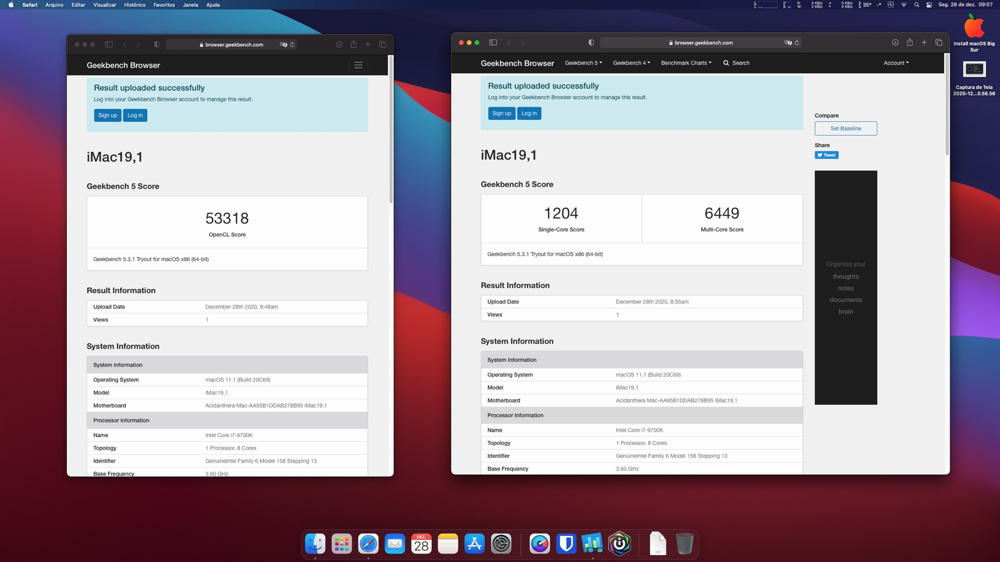

# hackingtosh-z390m-gaming

- [OpenCore 0.6.4](https://github.com/acidanthera/OpenCorePkg) bootloader
- Big Sur 11.1 ([olarila image 20C69](https://www.olarila.com/topic/6278-new-vanilla-olarila-images/))
- Gigabyte Z390M Gaming **BIOS** was updated to F9l

## Computer hardware

| Component           | Brank                                           |
| ------------------- | ----------------------------------------------- |
| CPU                 | Intel i7 9700K LGA1151                          |
| MotherBoard         | Gigabyte Z390M Gaming                           |
| Memory              | Corsair Vengeance 8G DDR4 3200 x 2 RGB pro      |
| Graphic Card        | RX 5600 XT 6GB                                  |
| SSD                 | SanDisk SDSSDA 240G                             |
| WIFI/Bluetooth Card | fenvi FV-HB1200                                 |
| Power               | Thermaltake Smart Series 600w                   |
| CPU Water Cooler    | Crater M1 Lite 240                              |
| Case                | GALAX Quasar                                    |
| Monitor             | DELL P2418D 24” 2K                              |
| Keyboard & Mouse    | A4 Tech LED USB KD-600L & Logitech MX Anywhere2 |
| Headphone           | Anker Soundcore Life Q10                        |

## BIOS Settings

I did basically this changes, following OpenCore install guide:

https://dortania.github.io/OpenCore-Install-Guide/config.plist/coffee-lake.html#intel-bios-settings

## config.plist Settings

**You must** modify Serial **Number**, **UUID**, **MLB** and **ROM** values in config.plist file. ROM value is the MAC address of your motherboard built-in network card, check it on BIOS settings.

## Screenshots

### Geekbench 5

